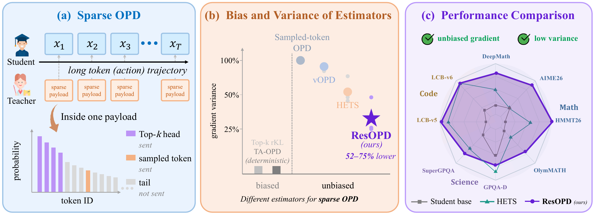
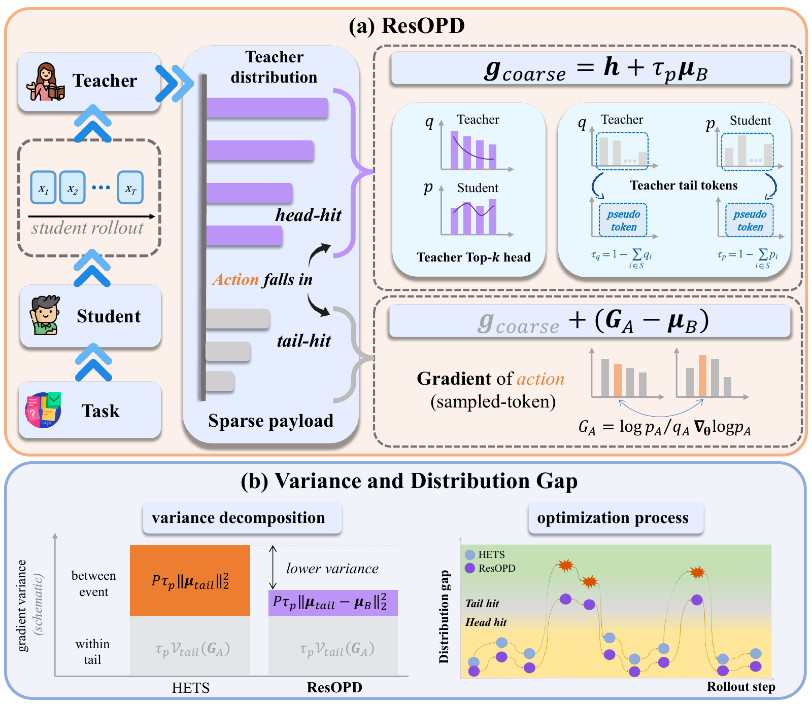

<div align="center">

<h1>ResOPD</h1>
<h3>Tail Residualization for Sparse On-Policy Distillation</h3>

<p><strong>Integrate the coarse distribution exactly. Sample only the fine-tail residual.</strong></p>

<p>
<a href="https://yph22.github.io/">Penghui Yang</a><sup>1,2</sup> ·
<a href="https://github.com/Cooperx521">Long Xing</a><sup>3</sup> ·
<a href="https://github.com/LennoxDai">Xuanlang Dai</a><sup>2,4</sup> ·
<a href="https://liuziyu77.github.io/">Ziyu Liu</a><sup>1,2</sup> ·
<a href="https://chenkai.site/">Kai Chen</a><sup>2</sup> ·
<a href="https://yuhangzang.github.io/">Yuhang Zang</a><sup>2</sup>
</p>

<p>
<sub><sup>1</sup> Shanghai Jiao Tong University &nbsp; <sup>2</sup> Shanghai Artificial Intelligence Laboratory<br>
<sup>3</sup> University of Science and Technology of China &nbsp; <sup>4</sup> Fudan University</sub>
</p>

<p>
<a href="https://arxiv.org/abs/2610.04882"></a>
<a href="https://arxiv.org/pdf/2610.04882"></a>
<a href="https://huggingface.co/datasets/ygyjrc/ResOPD-deepmath"></a>
<a href="https://github.com/verl-project/verl"></a>
<a href="#quick-start"></a>
<a href="LICENSE"></a>
</p>

<p>
<a href="#quick-start">Quick Start</a> &nbsp; · &nbsp;
<a href="#paper-highlights">Results</a> &nbsp; · &nbsp;
<a href="#method">Method</a> &nbsp; · &nbsp;
<a href="#implementation-map">Implementation</a> &nbsp; · &nbsp;
<a href="#citation">Citation</a>
</p>

</div>

<p align="center">

</p>

**ResOPD** estimates the full-vocabulary reverse-KL gradient from the teacher's
**Top-k probabilities and the sampled-token score**. It computes the observable
coarse gradient exactly and samples only the unresolved within-tail residual,
using the same sparse teacher payload and no additional teacher forward passes.

This repository provides the core implementation and its integration with
[verl](https://github.com/verl-project/verl). The
[paper](https://arxiv.org/abs/2610.04882) contains the derivations and experiments.
[UPSTREAM.md](UPSTREAM.md) records the pinned framework base and release scope.

## Paper highlights

| Evaluation | Reported result | Setting |
| :--- | :--- | :--- |
| Exact gradient audits | **52.5–75.0% lower covariance trace** than sampled-token OPD | Five frozen-prefix panels; teacher Top-4 |
| Mathematical reasoning | **50.12%** average score vs. **45.72%** for HETS | Qwen3.5-27B → Qwen3.5-4B |
| Science and coding transfer | **44.15%** average score vs. **43.63%** for HETS | Qwen3-30B-A3B-Instruct → Qwen3-4B |

These are results from the [paper's experimental protocols](https://arxiv.org/pdf/2610.04882).
The launcher below uses the released DeepMath training and held-out sets, with
a shorter response budget for the integration example.

## Quick start

### 1. Install

Use **Python 3.12** and a GPU environment compatible with the pinned verl base.

```bash
git clone https://github.com/InternLM/ResOPD.git
cd ResOPD
uv sync --extra fsdp --extra vllm
source .venv/bin/activate
```

The separate `recipe` submodule is optional for this example. See
[upstream installation guidance](docs/start/install.rst) for alternative
environments.

### 2. Prepare data

Download the paper's processed DeepMath subset from
[**ygyjrc/ResOPD-deepmath**](https://huggingface.co/datasets/ygyjrc/ResOPD-deepmath).
The files are already in verl format and can be used directly:

```bash
python - <<'PYDATA'
from huggingface_hub import hf_hub_download

for filename in ("train.parquet", "heldout.parquet"):
    hf_hub_download(
        repo_id="ygyjrc/ResOPD-deepmath",
        repo_type="dataset",
        filename=filename,
        local_dir="./data/resopd-deepmath",
    )
PYDATA
```

| File | Samples | Use |
| :--- | ---: | :--- |
| `train.parquet` | 1,024 | Distillation training |
| `heldout.parquet` | 252 | Held-out evaluation (`VAL_FILE`) |

The launcher defaults to these files under `data/resopd-deepmath`. To use another
local directory, set `DATA_DIR`, or override `TRAIN_FILE` and `VAL_FILE` individually.
The held-out split comes from the same screened DeepMath subset; the paper also
reports separate mathematical reasoning benchmarks. Evaluation uses verl's
boxed-answer math scorer; task rewards remain disabled for distillation.

### 3. Inspect and launch

```bash
# Print the resolved command.
DRY_RUN=1 bash examples/resopd/run_resopd.sh

# Start synchronous FSDP2/vLLM distillation.
bash examples/resopd/run_resopd.sh
```

| Default | Value |
| :--- | :--- |
| Student / teacher | Qwen3.5-4B / Qwen3.5-27B |
| GPU allocation | 4 student GPUs + 4 separate teacher GPUs, on one node |
| Teacher support | Top-k = 4 |
| Response budget | 32,768 tokens |
| Student sampling | Temperature = 1, top-p = 1, top-k = −1 |
| Update schedule | One PPO epoch; one mini-batch per fresh rollout batch |

Adjust model IDs, GPU allocation, tensor parallelism, and sequence lengths for
the available hardware. The student and teacher must share the token-ID
vocabulary. Extra Hydra overrides can be passed directly to the launcher.

<details>
<summary><strong>Add ResOPD to an existing verl OPD configuration</strong></summary>

```yaml
distillation:
  enabled: true
  distillation_loss:
    loss_mode: resopd
    topk: 4
    use_task_rewards: false
    use_policy_gradient: false
    loss_max_clamp: null
    log_prob_min_clamp: null
actor_rollout_ref:
  model:
    use_fused_kernels: false
  actor:
    use_torch_compile: false
    ppo_epochs: 1
  rollout:
    temperature: 1.0
    top_p: 1.0
    top_k: -1
```

Keep `use_chunked_topk=false` and set `ppo_mini_batch_size` equal to the
training batch size. Set `loss_mode: resopd` to select the estimator.

</details>

## Method

ResOPD separates an exact coarse update from a sampled fine-tail correction:

1. **Integrate the head.** Evaluate the teacher Top-k contributions analytically.
2. **Account for the tail bucket.** Use the residual student and teacher masses
   to compute the observable aggregate tail gradient.
3. **Sample the residual.** On tail hits, add only the unresolved fine-tail
   correction.

<details>
<summary><strong>Framework diagram</strong></summary>

<p align="center">

</p>

</details>

At a fixed prefix, let $p$ and $q$ be the student and teacher distributions,
$S$ the teacher Top-k support, and $A\sim p$ the actual student action. Define
$r_i=\log(p_i/q_i)$, $s_i=\nabla_\theta\log p_i$,
$\tau_p=1-\sum_{i\in S}p_i$, and $\tau_q=1-\sum_{i\in S}q_i$.

```math
\widehat{g}=
\underbrace{\sum_{i\in S}p_i r_i s_i+\tau_p\mu_B}_{\text{exact coarse gradient}}
+\mathbf{1}[A\notin S](r_A s_A-\mu_B).
```

```math
\mu_B=\log(\tau_p/\tau_q)\nabla_\theta\log\tau_p.
```

The code uses an algebraically equivalent centered support-event control.
Score coefficients and the event-centering mass are detached: the forward
value is used for logging, while backward supplies the estimator above.

**Sampling matters.** Unbiasedness assumes draws from the current full student
distribution. The launcher uses full-support sampling and a single update per
rollout batch. Truncated sampling, stale rollouts, repeated optimization passes,
and sampling-altering logits processors require separate treatment, as discussed
in the paper. No uniform variance ordering is claimed for every distribution.

## Implementation map

| Component | Source |
| :--- | :--- |
| PyTorch gradient estimator | [`resopd.py`](verl/trainer/distillation/resopd.py) |
| Packed tensors and sequence-parallel alignment | [`fsdp/losses.py`](verl/trainer/distillation/fsdp/losses.py) |
| Loss registration and response-masked metrics | [`distillation/losses.py`](verl/trainer/distillation/losses.py) |
| Teacher Top-k and observed-token score extraction | [`prompt_logprobs.py`](verl/workers/rollout/vllm_rollout/prompt_logprobs.py) |
| Held-out math scoring | [`deepmath_reward.py`](examples/resopd/deepmath_reward.py) |
| Training entry point | [`run_resopd.sh`](examples/resopd/run_resopd.sh) |
| Estimator, payload, and integration checks | [`tests/resopd`](tests/resopd) |

**Supported path:** vLLM teacher scoring and eager FSDP/FSDP2/VeOmni student
logits; the launcher uses FSDP2. Megatron students, SGLang teachers, fused student
loss kernels, and chunked Top-k are not enabled for ResOPD in this release.
The student still performs full-vocabulary normalization; sparse feedback
reduces teacher communication.

For the underlying framework documentation, see [README.verl.md](README.verl.md).

## Verification

Standalone estimator and teacher-payload checks require only PyTorch and pytest:

```bash
python -m pytest tests/resopd/test_estimator.py tests/resopd/test_teacher_payload.py -q
```

With verl's runtime dependencies installed, run the CPU integration checks:

```bash
python -m pytest tests/resopd/test_verl_integration.py -q
```

The checks cover exact finite-action gradients, the reverse-KL expectation,
variance identities, numerical precision, teacher-score alignment, and the
verl data path. [Release validation](tests/resopd/VALIDATION.md) records
**22 standalone checks and 13 integration checks**, plus comparison with the
original research kernel. The [GitHub workflow](.github/workflows/resopd-cpu.yml)
runs the standalone checks. A full GPU training run of this extracted port
is outside the recorded release validation.

## Citation

If you use ResOPD, please cite the [paper](https://arxiv.org/abs/2610.04882):

```bibtex
@misc{yang2026resopd,
  title         = {ResOPD: Tail Residualization for Sparse On-Policy Distillation},
  author        = {Penghui Yang and Long Xing and Xuanlang Dai and Ziyu Liu and Kai Chen and Yuhang Zang},
  year          = {2026},
  eprint        = {2610.04882},
  archivePrefix = {arXiv},
  url           = {https://arxiv.org/abs/2610.04882}
}
```

GitHub's **Cite this repository** entry also points to the paper through
[CITATION.cff](CITATION.cff).

## License and acknowledgments

Released under [Apache-2.0](LICENSE). ResOPD builds on
[verl](https://github.com/verl-project/verl) and retains its original copyright
and license notices. The overview and framework figures are from the ResOPD
paper.
